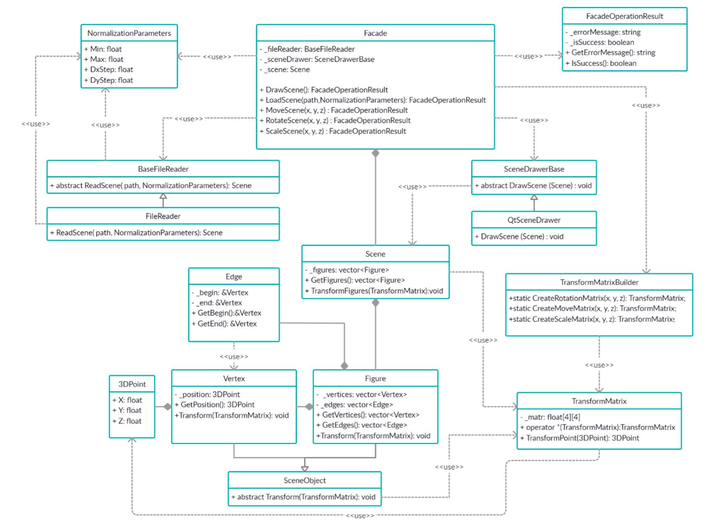
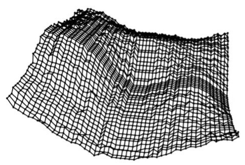
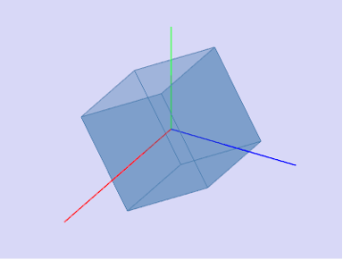
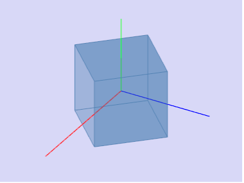
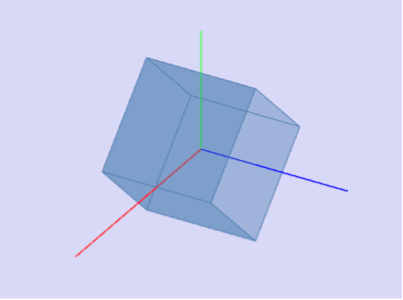

# Лабораторная работа №3 "Визуализация 3D поверхности"

## Архитектура приложения

Программа должна состоять из двух доменов: "бизнес-логики" и "Интерфейса". Домены должны разделяться при помощи паттерна "Фасад", создание объектов `TransformMatrix` должно осуществляться при помощи паттерна "Фабричный метод".

#### Модуль "бизнес-логики"
Реализует все операции над файлами и данными. Считает значения для поворота, перемещения, изменения масштаба (все операции необходимо выполнять через матрицы). Также в этом домене производится подготовка к отрисовке. Диаграмма классов представлена на рисунке 1. Использование функций Qt в модуле "бизнес-логики" запрещено. 

  
  
Рисунок 1 Диаграмма классов

#### Модуль интерфейса
Реализует логику отображения интерфейса приложения. Использует классы Qt. Никаких вычислений в нем производиться не может, он отвечает исключительно за визуализацию и передачу управляющих команд.

## Задание

Разработать программу для визуализации функции двух переменных в трехмерном пространстве. 

Программа должна предоставлять возможность: 

* загружать значения функции из выбранного пользователем csv-файла (подробнее - см. Входные данные);
* задавать шаг и диапазон нормировки значений;
* визуализировать нормированные (см. примечание) значения функции в виде поверхности в трехмерном пространстве с учетом заданного шага и диапазона нормировки;
* смещать камеру (точку обзора) по осям координат (x, y, z);
* вращать камеру (точку обзора) относительно осей координат (x, y, z);
* масштабировать объект.

Интерфейс программы должен содержать: 

* кнопку для выбора файла (fileDialog) и поле для вывода его названия;
* зону визуализации;
* поля для ввода шага между соседними точками и диапазона нормировки;
* управляющие элементы для перемещения, масштабирования и поворотов объекта по трем осям. 

*Входные данные:*

* csv-файл с матрицей, содержащий N строк и M столбцов, в которых записаны числовые значения функции двух переменных;
*	шаг (расстояния между соседними точками) по осям X, Y;
*	диапазон нормировки;
* управляющие команды для перемещений и поворотов камеры;

*Выходные данные (результат):*

* трехмерная каркасная поверхность, отображающая данные из файла;
* перемещение и поворот камеры.

*Пример входных данных*

Содержимое CSV файла:

|<!-- -->|<!-- -->|<!-- -->|
|-----|-----|-----|
|  1  |  2  |  3  |
|  2  |  3  |  4  |
|  3  |  4  |  5  |
|  4  |  5  |  5  |

*Вводимые данные:*

|        <!-- -->        | <!-- --> |
|------------------------|:--------:|
|  Шаг:                  |    1     |
|  Диапазон нормировки:  |  [0, 1]  |

*Пример визуализации*

На рисунке 2 изображен пример трёхмерной визуализации. Использованный датасет отличается от приведенного в разделе "пример входных данных" и датасетов из заданий по вариантам.

  
  
Рисунок 2 Каркасная модель

Вариант определяется по номеру студента в группе:

* вариант 1 – для нечетных номеров.
* вариант 2 – для четных номеров. 

## Полезная информация
## Нормировка данных

Входные данные могут иметь разные значения. Если при выводе расстояние между соседними точками будет равно 1, а значения соседних точек будет отличаться, например на 1000 – работать с визуализированными данными будет затруднительно. Для устранения этой проблемы значения необходимо нормировать - т.е. масштабировать таким образом, чтобы данные укладывались в некоторый фиксированный диапазон.

*Пример:*

|        <!-- -->                           |    <!-- -->     |
|-------------------------------------------|:---------------:|
|  Значения функции:                        | 10, -30, 20, 30 |
|  После нормирования к диапазону [-3, 3]:  |   1, -3, 2, 3   |

### Формулы для нормировки значений:

$$
x_i - исходное~значение
$$
$$
[a, b] - диапазон~нормировки 
$$

$$
X'=a+\frac{X-X_{min}}{X_{max}-X_{min}}*(b-a)~-~нормированное~значение 
$$

### Трехмерные преобразования

*Перенос*

Перенос точки в трёхмерном пространстве осуществляется простым добавлением константы к соответствующей координате точки: 

* по оси Х $x'=x + с1$; 
* по оси Y $y'=y + с2$; 
* по оси Z $z'=z + с3$; 

Смещение по каждой координате производится независимо, из чего следует, что для осуществления комплексного смещения сразу по нескольким координатам, необходимо выполнить перенос по каждой из осей по очереди. К примеру, для смещения сразу по осям Ох и Оу сначала необходимо выполнить смещение по оси Ох, а потом для получившегося результата выполнить смещение по Оу. 

*Масштабирование*

Для увеличения или уменьшения объекта по заданной оси, необходимо домножить соответствующую координату на константу. 

* По оси Х $x'=x * с1$; 
* По оси Y $y'=y * с2$;
*	По оси Z $z'=z * с3$; 

Наиболее частым случаем, является однородное масштабирование объекта, при котором выбирается единый коэффициент масштабирования по всем трём осям $(c1 = c2 = c3 = c)$. Коэффициент однородного масштабирования принимает следующие значения: $c = [0, +∞)$. Причём, для выполнения уменьшения объекта необходимо выбирать $c = [0, 1)$, для выполнения увеличения $c = (1, +∞)$. Если при масштабировании задать отрицательное число, будет осуществлено масштабирование с отражением относительно плоскости. В рамках задания допускается использование только положительного масштаба. 

*Вращение*

Вращение осуществляется с помощью матриц поворота.

Матрица поворота (или матрица направляющих косинусов) – это ортогональная матрица, которая используется для выполнения собственного ортогонального преобразования в евклидовом пространстве. При умножении любого вектора на матрицу поворота длина вектора сохраняется. Определитель матрицы поворота равен единице.
Обычно считают, что, в отличие от матрицы перехода при повороте системы координат (базиса), при умножении на матрицу поворота вектора-столбца координаты вектора преобразуются в соответствии с поворотом самого вектора (а не поворотом координатных осей̆; то есть при этом координаты повернутого вектора получаются в той же, неподвижной системе координат). Однако отличие той и другой матрицы лишь в знаке угла поворота, и одна может быть получена из другой заменой угла поворота на противоположный; та и другая взаимно обратны и могут быть получены друг из друга транспонированием. 

Любое вращение в трехмерном пространстве может быть представлено как композиция поворотов вокруг трех ортогональных осей (например, вокруг осей декартовых координат). Этой композиции соответствует матрица, равная произведению соответствующих трех матриц поворота. 
Матрицами вращения вокруг оси декартовой системы координат на угол α в трёхмерном пространстве являются: 

*Вращение вокруг оси x:*

$$
M_x(α)=\begin{pmatrix}
1 & 0 & 0 \\
0 & cosα & -sinα \\
0 & sinα & cosα
\end{pmatrix}
$$

*Вращение вокруг оси y:*

$$
M_y(α)=\begin{pmatrix}
cosα & 0 & sinα \\
0 & 1 & 0 \\
-sinα & 0 & cosα
\end{pmatrix}
$$

*Вращение вокруг оси z:*

$$
M_z(α)=\begin{pmatrix}
cosα &  -sinα & 0 \\
sinα & cosα & 0 \\
0 & 0 & 1
\end{pmatrix}
$$

После преобразований мы получаем формулы:

По оси Х:

$$
x'=x \\
y':=y*cos(α)-z*sin(α) \\
z':=y*sin(α)+z*cos(α) \\
$$

  

По оси Y:

$$
x'=x*cos(α)+z*sin(α) \\
y'=y \\
z'=-x*sin(α)+z*cos(α) \\
$$

  

По оси Z:

$$
x'=x*cos(α)-y*sin(α) \\
y'=x*sin(α)+y*cos(α) \\
z'=z
$$

  

*Примечание:*
на графиках красная ось соответствует оси OX, зелёная – OY, синяя – OZ.

Все три поворота делаются независимо друг от друга, т.е. если надо повернуть вокруг осей Ox и Oy, вначале делается поворот вокруг оси Ox, потом применительно к полученной точки делается поворот вокруг оси Oy. 
Положительным углам при этом соответствует вращение вектора против часовой стрелки в правой системе координат, и по часовой стрелке в левой системе координат, если смотреть против направления соответствующей оси. Правая система координат связана с выбором правого базиса. 
